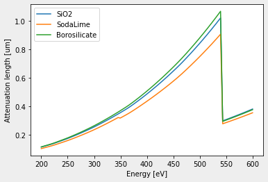

# SXT LAC

Implementation of calculating linear attenuation coefficients based on the tabulated values of 
[CRXO](https://henke.lbl.gov/optical_constants/).

The linear absorption coefficient is calculated based on pure photoabsorption, such that [1]

$$\sigma_a = 2 r_e \lambda f_2.$$

The compound (mass) absorption coefficients are calculated by 

$$\mu = \frac{N_A}{MW}\sum_i x_i\sigma_{ai}.$$

Data source:
Atomic Scattering factors taken from [CRXO](https://henke.lbl.gov/optical_constants/asf.html) [2] .

Atomic Weight values from NIST compilation of [Atomic Weights of the Elements 1997](https://www.nist.gov/pml/atomic-weights-and-isotopic-compositions-relative-atomic-masses).


## Install

```
pip install --upgrade .
```   

## Usage
Example plotting the attenuation lengths within the water window:
``` python
import matplotlib.pyplot as plt
import numpy as np
from sxtlac import LAC

xx = np.linspace(200, 600, 100)
#default unit is um, all SI prefixes are defined
lac_H2O = LAC('H2O',1)(xx, unit ='um') 
lac_SiO2 = LAC('SiO2',2.2)(xx)
lac_C = LAC('C',2.2)(xx)
plt.plot(xx,1/lac_H2O,label = 'H2O')
plt.plot(xx,1/lac_SiO2,label = 'SiO2')
plt.plot(xx,1/lac_C,label = 'C')
plt.legend()
plt.ylabel('Attenuation length [um]')
plt.xlabel('Energy [eV]')
```   


``` python
lac_SiO2 = LAC('SiO2',2.2)
# The composition is normalized to 100 % If you forget to.
sodalime = LAC_mixture(('SiO2',74),
                       ('Na2O',13),
                       ('CaO',1.3),                   
                       2.52)

borosilicate = LAC_mixture(('SiO2',81),
                           ('B2O3',12.5),
                           ('Na2O',4),
                           ('AlO3',2.2)
                           ,2.235)

xx = np.linspace(200, 600, 100)
plt.plot(xx, 1/lac_SiO2(xx),label = 'SiO2')
plt.plot(xx, 1/sodalime(xx),label = 'SodaLime')
plt.plot(xx, 1/borosilicate(xx),label = 'Borosilicate')
plt.legend()
plt.ylabel('Attenuation length [um]')
plt.xlabel('Energy [eV]')
```   


## Reference

[1] Booklet, X-Ray Data. "X-ray Data Booklet." Laboratory, Univ. California (2001). https://xdb.lbl.gov/

[2] B.L. Henke, E.M. Gullikson, and J.C. Davis. X-ray interactions: photoabsorption, scattering, transmission, and reflection at E=50-30000 eV, Z=1-92, Atomic Data and Nuclear Data Tables Vol. 54 (no.2), 181-342 (July 1993).


